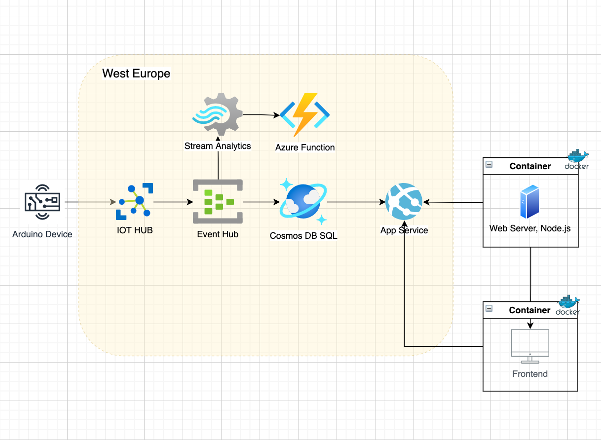

To run the project locally

1. Install dependencies

```
npm i
```

2. Run the project in dev mode

```
npm dev
```

3. Run the project in dev mode with DEBUG flag

```
DEBUG=app* npm run dev
```

4. Add needed enviromental variables to .env

```
PORT =
COSMOS_DB_ACCOUNT_URI =
COSMOS_DB_ACCOUNT_KEY =
```

5. For now this implementation of API is searving mock data from Azure Cosmos DB

```
{
"telemetryData": [
    {
        "id": "1",
        "connectionDeviceId": "keep-the-box-green-device",
        "connectionDeviceGenerationId": "637669621042053570",
        "enqueuedTimeUTC": "2021-09-11T17:57:36.4340000Z",
        "temperature": 28.202403706127036,
        "humidity": 64.96773367978993,
        "_rid": "AQ99ALrBAPgBAAAAAAAAAA==",
        "_self": "dbs/AQ99AA==/colls/AQ99ALrBAPg=/docs/AQ99ALrBAPgBAAAAAAAAAA==/",
        "_etag": "\"04009225-0000-1500-0000-6145b9480000\"",
        "_attachments": "attachments/",
        "_ts": 1631959368
    },
]
}
```

6. Run Dockerfile
```
docker build . -t keep-the-box-green-api
docker run -p 8080:8080  keep-the-box-green-api
```

7. Deployed with Azure 

[Link](https://keeptheboxgreen-api.azurewebsites.net/)

8. MVP cloud infrastructure diagram

Inline-style: 
