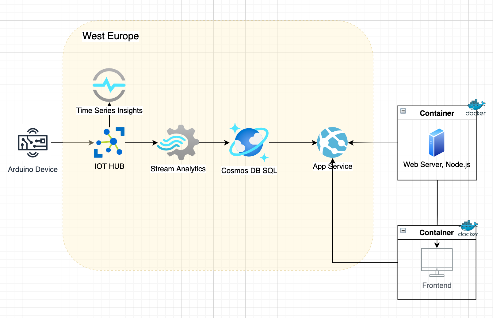

### Table of contents

- [Project Description](#project-description)
- [Deployment](#deployment)
- [Cloud infrastructure diagram](#cloud-infrastructure-diagram)
- [Cloud services](#cloud-services)
- [Local Installation](Local-installation)
- [Data schema](#data-schema)
- [Docker](#docker)

### Project Description

This project is a REST API which is serving data from Azure Cosmos DB. Azure Cosmos DB consists of constantly updated data from IOT hub.
### Deployment

The app is deployed with Azure App Services

[keepTheBoxGreen-api](https://keeptheboxgreen-api.azurewebsites.net/)


### Cloud infrastructure diagram:



### Cloud services

1. Azure Cosmos DB. This application uses native Core (SQL) API, one of the main reasons for choosing this database was because our implementation required Stream Analytics that only works with SQL API.
2. IOT Hub
3. Stream Analytics
4. App Services

### Local Installation

#### Pre-Installed Requirements

* NPM an Node (v.14.0) installed (check with npm --version and node --version)
* Docker

#### To run the project locally in development mode

1. Clone repo and install dependencies

```
npm i
```

2. Run the project in dev mode

```
npm run dev
```

3. Run the project in dev mode with DEBUG flag

```
DEBUG=app* npm run dev
```
4. Navigate to http://localhost:8080
#### To run the project locally in production mode

1. Install dependencies

```
npm i
```

2. Build the project (it will create /dist folder)

```
npm run build
```

2. Run the project

```
npm run start
```

#### Note: Do not forget to add needed enviromental variables to .env

```
PORT =
COSMOS_DB_ACCOUNT_URI =
COSMOS_DB_ACCOUNT_KEY =
```

### Data schema

Data is served from Azure SQL Cosmos DB

#### Data schema of telemetryData container

| Fields                       | Type   |
| ---------------------------- | ------ |
| id                           | string |
| connectionDeviceId           | string |
| connectionDeviceId           | string |
| connectionDeviceGenerationId | string |
| temperature                  | float  |
| humidity                     | float  |
| sittingTime                  | int    |
| dustConcentration            | float  |

#### Example of response

```json
{
  "telemetryData": [
    {
      "id": "1",
      "connectionDeviceId": "keep-the-box-green-device",
      "connectionDeviceGenerationId": "637669621042053570",
      "eventTimestamp": "2021-09-11T17:57:36.4340000Z",
      "temperature": 28.2, // celsius
      "humidity": 64.96, // %
      "sittingTime": 60000, // milliseconds
      "dustConcentration": 64.8 // ug/m3
    }
  ]
}
```

### Docker

The app has been containerized and has two Docker files for production and development.
#### To run Docker container

```
docker build . -t keep-the-box-green-api
docker run -p 8080:8080  keep-the-box-green-api
```

NOTE: There is also Dockerfile.dev. In order to build an image with Dockerfile.dev:

```
docker build -t keep-the-box-green-api-dev -f Dockerfile.dev .
```
#### Image is stored in Docker hub

[keepTheBoxGreen-api docker hub](https://hub.docker.com/repository/docker/irinabaeva/keeptheboxgreen-api-docker)

### CI/CD

The work and collaboration within the project is following CI/CD principles. 
....WIP
