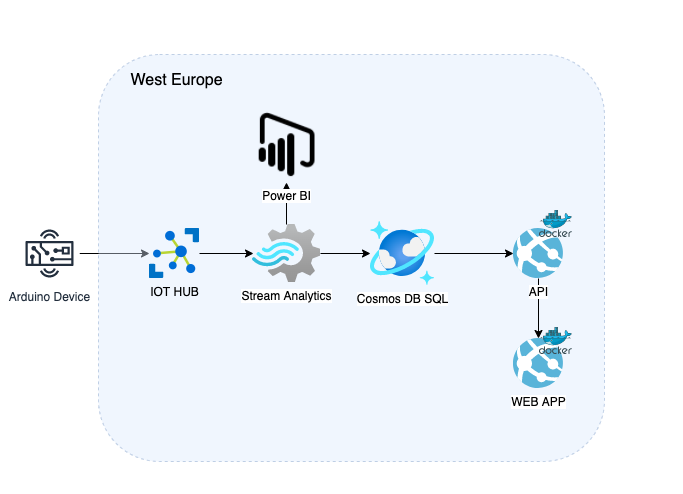

### Table of contents

- [Project Description](#project-description)
- [Deployment](#deployment)
- [Local Installation](local-installation)
- [Data schema](#data-schema)
- [Docker](#docker)
- [Cloud infrastructure diagram](#cloud-infrastructure-diagram)
- [Cloud services](#cloud-services)
- [Data flow](#data-flow)
- [Continuous integration and continuous delivery](#continuous-integration-and-continuous-delivery)

### Project Description

The main goal is to build an Arduino device, which is going to collect data from different sensors. It has simple logic behind which helps to indicate if any working conditions are violated by changing the colour of a box #keepTheBoxGreen. For example when a person is sitting in front of the laptop for more than 1 hour or air quality has dropped too much, the light of the box will change its colour to red and LCD display will print an appropriate advice. 

This repo is a REST API built with Express and TS. It is serving data from Azure Cosmos DB. Azure Cosmos DB consists of constantly updated data from IOT hub though Stream Analytics job.

Check [link](https://github.com/some-otter-thing/keepTheBoxGreen-arduino) for arduino repository.

### Deployment

The app is deployed with Azure App Service

* Production environment of containerized app [keepTheBoxGreen-api](https://keeptheboxgreen-prod.azurewebsites.net/)
* Staging environment of containerized app [keepTheBoxGreen-api](https://keeptheboxgreen-staging.azurewebsites.net/)
* Deployment of not containerized app (just for learning purpose) [keepTheBoxGreen-api](https://keeptheboxgreen-api.azurewebsites.net/)

### Local Installation

#### Pre-Installed Requirements

- NPM an Node (v.14.0) installed (check with npm --version and node --version)
- Docker

#### To run the project locally in development mode

1. Clone repo and install dependencies

```
npm i
```

2. Run the project in dev mode

```
npm run dev
```

3. Run the project in dev mode with DEBUG flag

```
DEBUG=app* npm run dev
```

4. Navigate to http://localhost:${PORT} depending on the PORT you specified in the .env file

#### To run the project locally in production mode

1. Install dependencies

```
npm i
```

2. Build the project (it will create /dist folder)

```
npm run build
```

2. Run the project

```
npm run start
```

#### Note: Do not forget to add needed enviromental variables to .env

```
PORT =
COSMOS_DB_ACCOUNT_URI =
COSMOS_DB_ACCOUNT_KEY =
```

### Data schema

Data is served from Azure SQL Cosmos DB

#### Data schema of telemetryData container

| Fields                       | Type   |
| ---------------------------- | ------ |
| id                           | string |
| connectionDeviceId           | string |
| connectionDeviceId           | string |
| connectionDeviceGenerationId | string |
| temperature                  | float  |
| humidity                     | float  |
| sittingTime                  | int    |
| dustConcentration            | float  |

#### Example of response

```json
{
  "telemetryData": [
    {
      "id": "1",
      "connectionDeviceId": "keep-the-box-green-device",
      "connectionDeviceGenerationId": "637669621042053570",
      "eventTimestamp": "2021-09-11T17:57:36.4340000Z",
      "temperature": 28.2,
      "humidity": 64.96,
      "sittingTime": 60000,
      "dustConcentration": 64.8
    }
  ]
}
```

Note: temperature is shown in celsius, humidity - in %, sittingTime - in milliseconds, dustConcentration - in ug/m3

### Docker

The app has been containerized and has two Docker files for production and development.

#### To run Docker container

```
docker build . -t keep-the-box-green-api
docker run -p 8080:8080  keep-the-box-green-api
```

NOTE: There is also Dockerfile.dev. In order to build an image with Dockerfile.dev:

```
docker build -t keep-the-box-green-api-dev -f Dockerfile.dev .
```

#### Image is stored in Docker hub

Docker hub is Docker's official cloud-based registry for Docker images

[keepTheBoxGreen-api docker hub](https://hub.docker.com/repository/docker/irinabaeva/keeptheboxgreen-api-docker)

### Cloud infrastructure diagram:



### Cloud services

1. Azure Cosmos DB. This application uses native Core (SQL) API, one of the main reasons for choosing this database was because our implementation required Stream Analytics that only works with SQL API.
2. IOT Hub
3. Stream Analytics
4. App Services

### Data Flow
The board uses Azure cloud provider for publishing and storing data.


### Continuous integration and continuous delivery
#### Tools of CI/CD:
1. Pipeline : Github 
2. Container registery: Docker Hub
3. Web hosting service : Azure App Service
#### Diagram of deployment pipeline:


The work and collaboration within the project is following CI/CD principles.
The main jobs of CI/CD pipeline:
* build (build, test, lint, upload artifact)
* sonarcloud (in the future it will have code coverage scan)
* docker (build image and push to docker hub)
* deployProduction (this step is present just for learning purposes, since the main deployment has been done with containerized app)
* deployContainerizedProd

##### Workflow on pull request


Push to main branch is protected and requires Build, Sonar Cloud and Deploy to staging status checks to pass before merging

Deployment step is protected and requires manual trigger (approval) of reviewer.

##### Workflow on push to main branch


There is an email notification. Deployment is finished after approval.
##### Successful deployment


